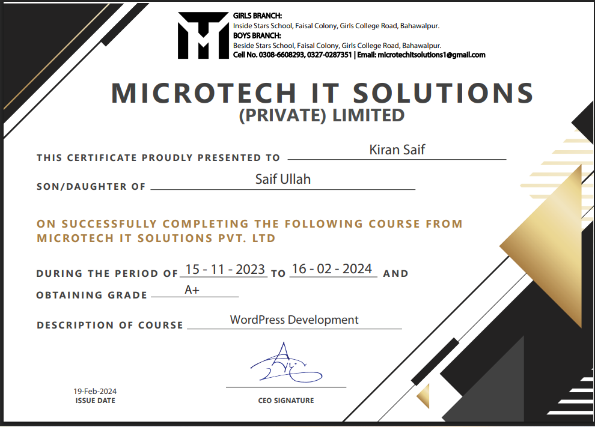
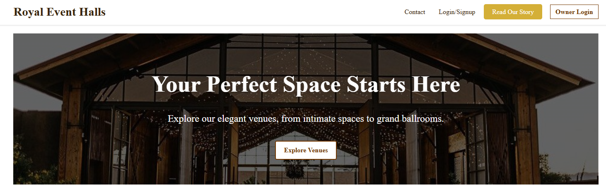
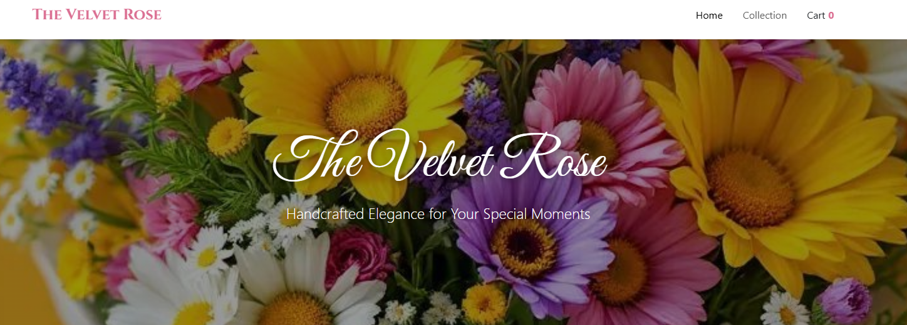
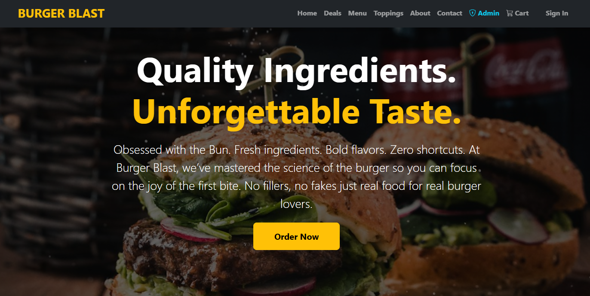
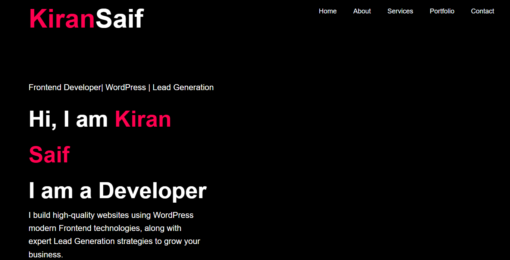
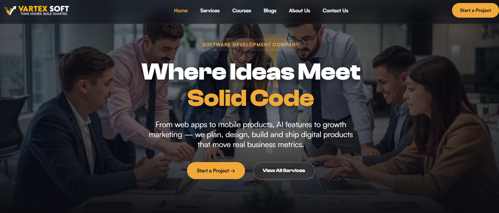
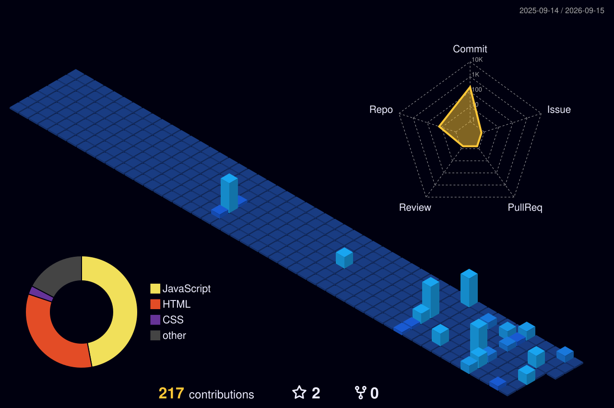

 

### ✨ Quick Glance

<table>
<tr>
<td align="center" width="25%">📍 <b>Bahawalpur, PK</b></td>
<td align="center" width="25%">🎓 <b>BS CS · 6th Sem</b></td>
<td align="center" width="25%">💼 <b>Intern @ Code Thinker</b></td>
<td align="center" width="25%">🟢 <b>Open to Freelance</b></td>
</tr>
</table>

<h3 align="center">🌟 About Me</h3>

Hi, I'm Kiran — a full stack and WordPress developer studying Computer Science at The Islamia University of Bahawalpur. I love turning a design brief into a polished, working site: clean front-end builds, complete WordPress projects, and everything that connects them. Currently interning at Code Thinker, where I get to sharpen these skills on real, live work.

### 🎓 Education

 

 

### 📜 Certification

 

 

  

### 💼 Experience

 

### 🛠️ Tech Stack

**Frontend**

**Backend**

**Database & Tools**

<h2 align="center">🚀 Featured Projects</h2>

<h3 align="center">💻 Web Development</h3>

<table>
<tr>
<td width="50%" valign="top">

**🏛️ [Royal Event Halls](https://kiransaif-developer.github.io/RoyalEvent-Halls-System/)**
An elegant venue-booking site for exploring and reserving event spaces.
`HTML` `CSS` `JS`

</td>
<td width="50%" valign="top">

**🌹 [The Velvet Rose](https://kiransaif-developer.github.io/Velvet-Rose/)**
A florist e-commerce site with a handcrafted, boutique feel.
`HTML` `CSS` `JS`

</td>
</tr>
<tr>
<td width="50%" valign="top">

**🍔 [Burger Blast](https://kiransaif-developer.github.io/bites-and-burgers/)**
A bold, modern fast-food ordering site with a full menu and cart.
`HTML` `CSS` `JS`

</td>
<td width="50%" valign="top">

**🌐 [My Portfolio](https://kiransaif-developer.github.io/Personal-Porfolio/)**
Personal portfolio showcasing skills, services, and projects.
`HTML` `CSS` `JS`

</td>
</tr>
<tr>
<td width="50%" valign="top">

**🏢 [VartexSoft](https://kiransaif-developer.github.io/vartexsoft-website/)**
A software development company site — services, courses, and blog.
`HTML` `CSS` `JS`

</td>
<td width="50%" valign="top">

</td>
</tr>
</table>

<h3 align="center">📝 WordPress</h3>

<table>
<tr>
<td width="50%" valign="top">

**🚕 [Leverage Airport Taxi Services](https://leverageairporttaxi.co.uk/)**
A UK-based airport transfer booking site — live client project.
`WordPress`

</td>
<td width="50%" valign="top">

</td>
</tr>
</table>

<h3 align="center">📊 GitHub Metrics & Activity</h3>

<h3 align="center">📈 Contribution Activity</h3>

<h3 align="center">🏙️ 3D Contribution Calendar</h3>

⚙️ Generates automatically once the GitHub Action (profile-3d.yml) is set up in the profile repo.

<i>✨ Thanks for visiting — always crafting something new. ✨</i>

